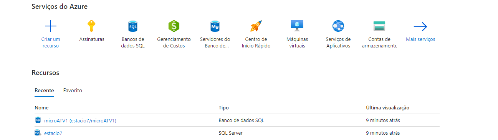
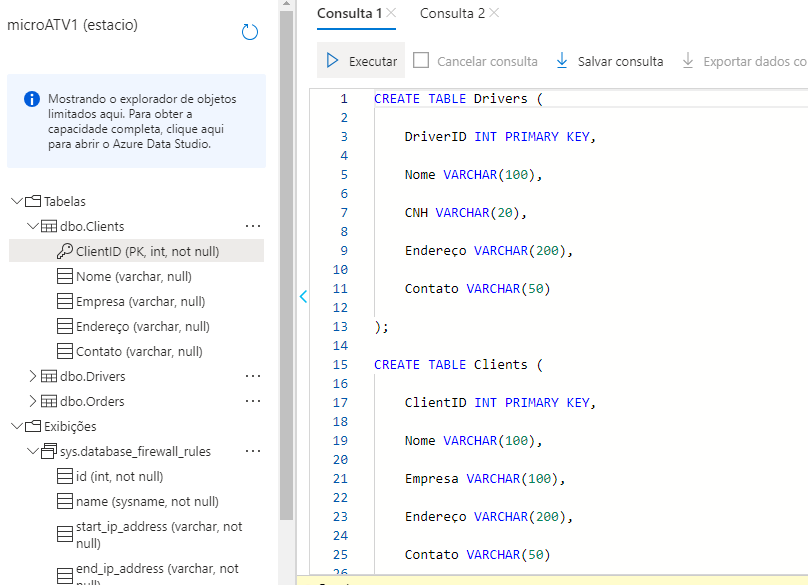
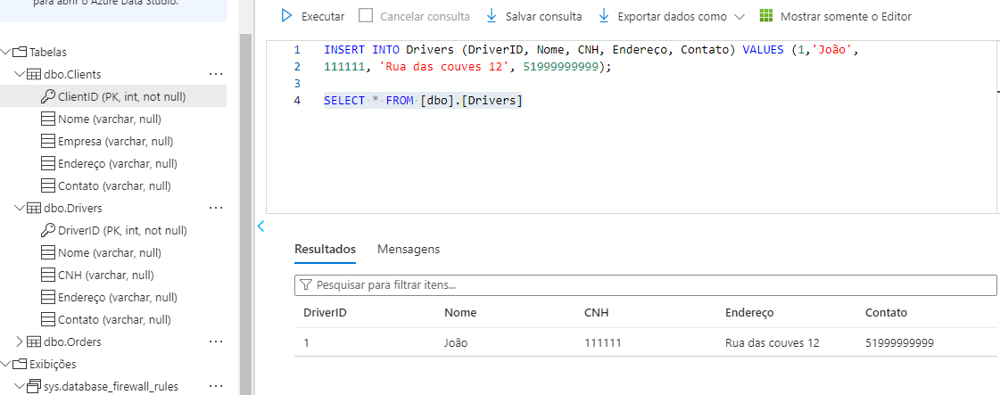
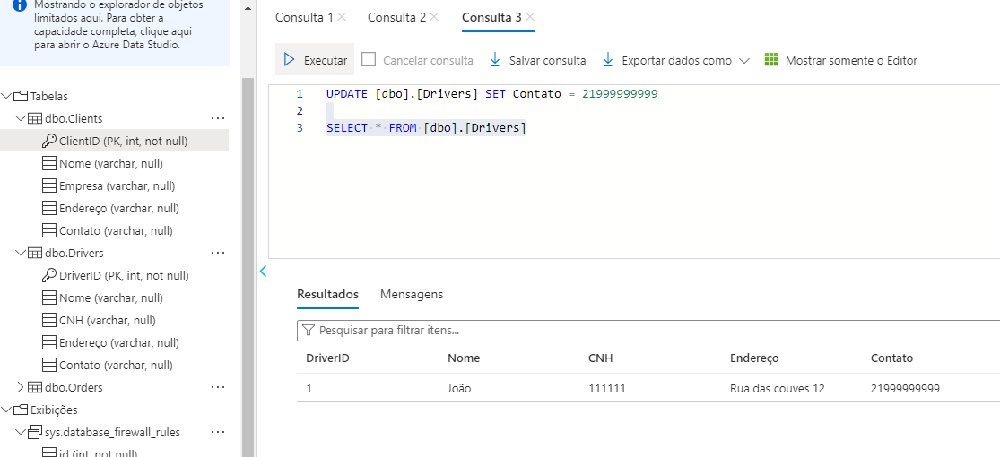
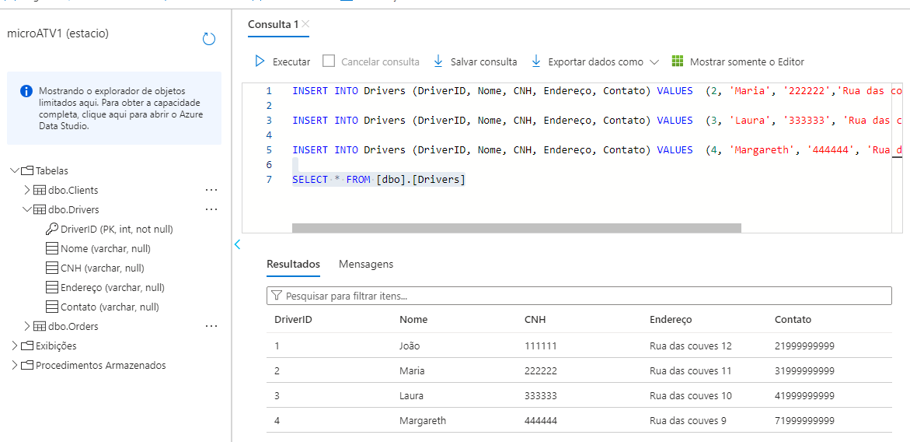
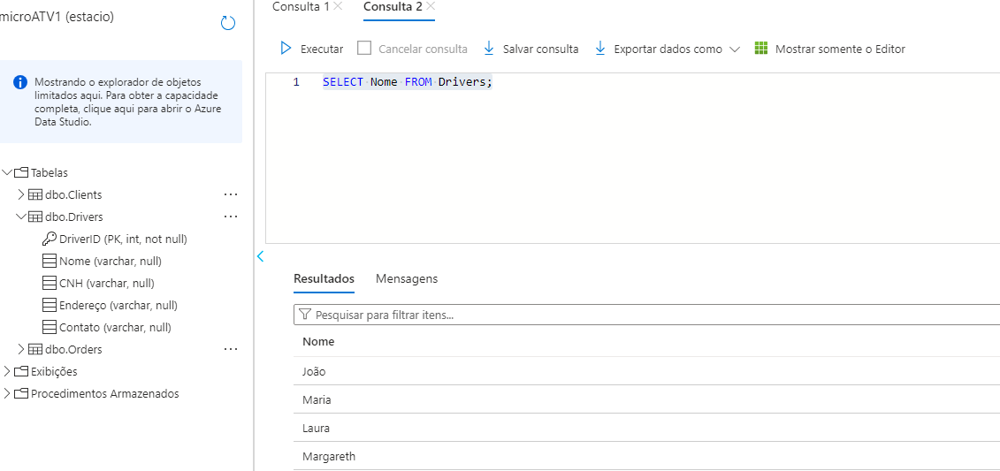
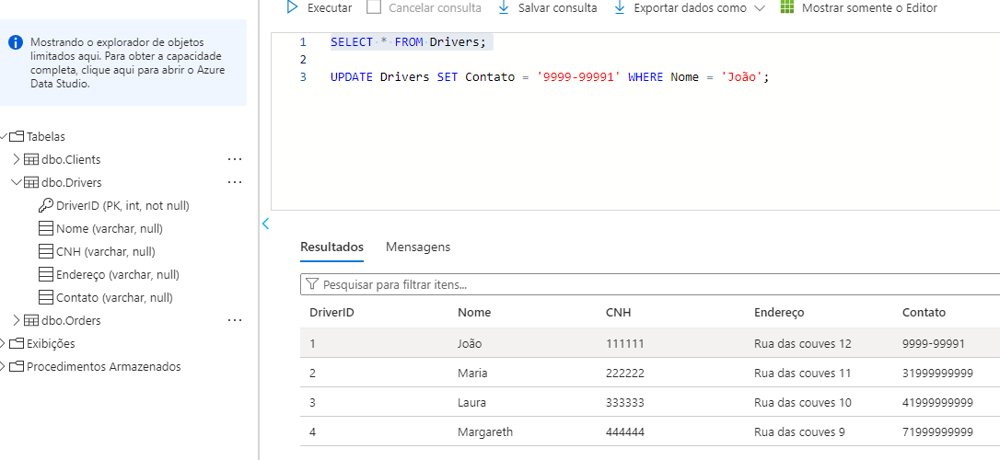
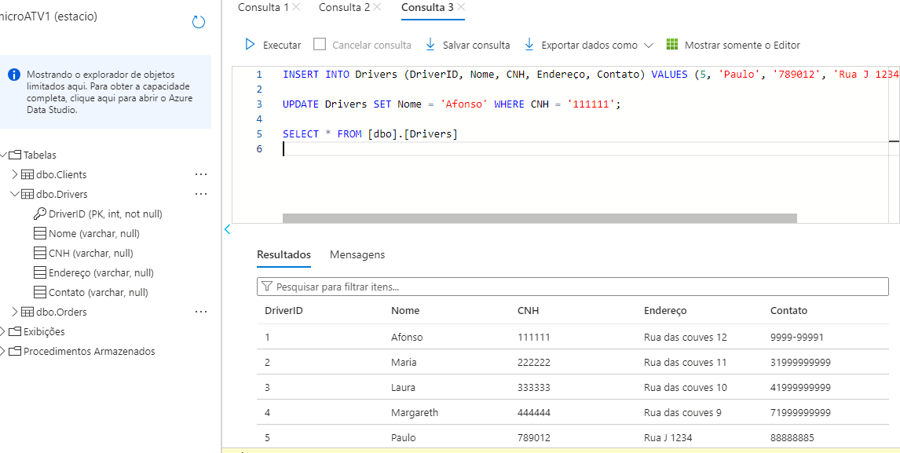
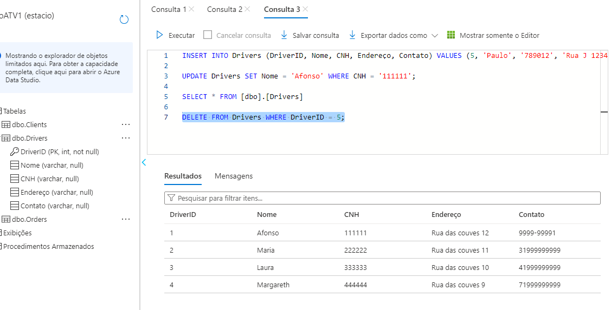

# Missão Prática | Nível 4 | Mundo 4

## Objetivos da Atividade

Mostrar competência na criação e gestão de recursos na Nuvem Azure,
adquirindo conhecimento sobre a estrutura fundamental da plataforma Azure.
Utilizar eficientemente o portal Azure para criar e configurar uma Máquina Virtual
(VM), demonstrando entendimento dos recursos e suas funcionalidades.
Configurar regras de rede e grupos de segurança, adquirindo conhecimento sobre a
estrutura das regras de rede na Nuvem Azure.
Importar um arquivo .bacpac para um banco de dados no Banco de Dados SQL do
Azure;
Criar e configurar um aplicativo web no Azure, demonstrando compreensão do
mecanismo de hospedagem e implantação de aplicações web.

## Resultados Esperados ✨

Ao finalizar a atividade, espera-se que o aluno provisionará um banco de dados para a
LogiMove Transportes, que estará funcional e otimizado para operações diárias e
preparado para futura escalabilidade. Para isso, as seguintes etapas devem ser
concluídas e apresentadas:

## Configuração e Acesso ao Banco de Dados:
Banco de dados corretamente configurado no Azure SQL.
Acesso ao banco de dados estabelecido sem problemas, garantindo
conectividade e segurança.

## Criação e Estruturação das Tabelas:
Tabelas criadas no banco de dados conforme a estrutura sugerida,
incluindo tabelas para Motoristas, Clientes e Pedidos.

## Inserção e Gestão de Dados:
Dados de teste inseridos nas tabelas, cobrindo diferentes cenários e casos de
uso.

## Execução e Validação de Consultas:
Consultas T-SQL executadas com sucesso, com a capacidade de recuperar, filtrar
e ordenar dados conforme necessário.

## Operações CRUD Eficientes:
Demonstração de operações CRUD - Criar, Ler, Atualizar e Deletar dados.
Testes para garantir que as operações CRUD estão funcionando conforme
o esperado, com respostas rápidas e precisas.

